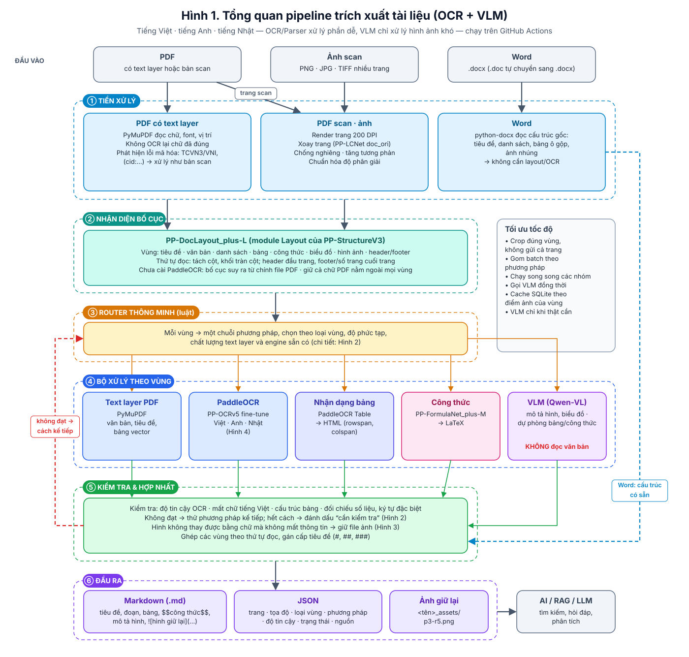
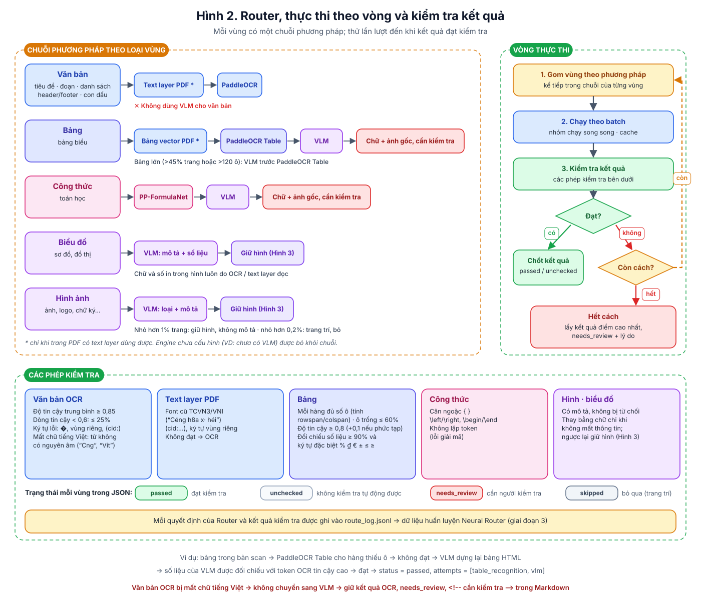
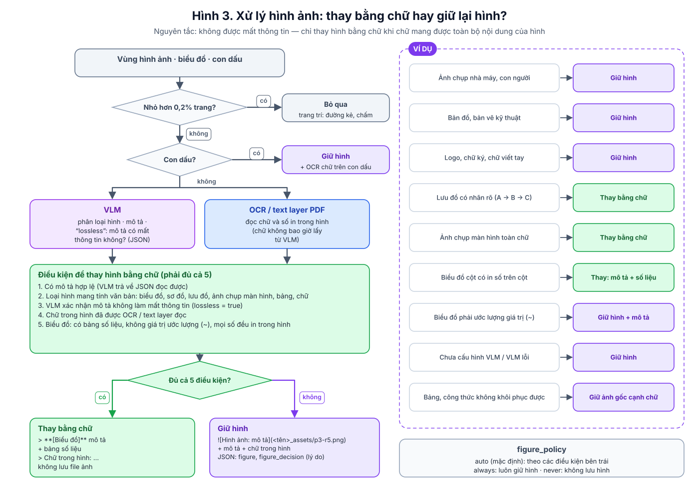
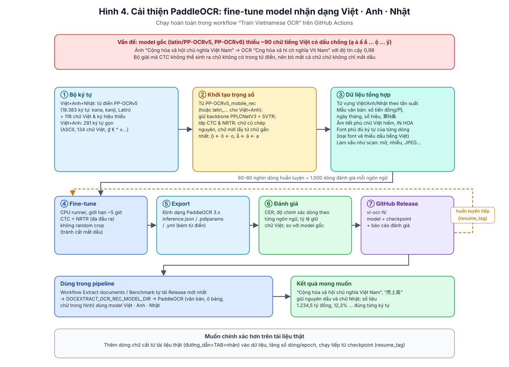

# docextract — Trích xuất tài liệu doanh nghiệp bằng OCR + VLM (Việt + Anh · Việt + Anh + Nhật)

## Mục đích

Chuyển **tài liệu của doanh nghiệp** — báo cáo tài chính, báo cáo thường niên, nghị quyết, biên bản, công văn,
hợp đồng, hóa đơn, chứng từ… bằng tiếng Việt, tiếng Anh (và tiếng Nhật) — ở mọi dạng thường gặp (PDF số, bản scan,
ảnh chụp, Word, Excel/PowerPoint) thành **Markdown + JSON đúng và đủ nội dung**, để đưa vào hệ thống của doanh nghiệp:
tìm kiếm, hỏi đáp bằng AI (RAG / LLM), trích xuất số liệu, lưu trữ số.

Công cụ được đánh giá theo đúng mục đích đó:

| Yêu cầu | Nghĩa là |
|---|---|
| Đúng từng chữ, từng con số | Chữ tiếng Việt có dấu, số tiền, ngày tháng, số hiệu văn bản không được sai hay mất; văn bản chỉ lấy từ text có sẵn trong file hoặc OCR, **không bao giờ do VLM viết ra** |
| Giữ cấu trúc | Tiêu đề, đoạn, danh sách, bảng (cả ô gộp, bảng nối qua trang), công thức, thứ tự đọc |
| Không mất thông tin | Hình, biểu đồ, con dấu không mô tả hết bằng chữ thì giữ nguyên ảnh |
| Truy vết được | Mỗi phần có trang, vị trí, phương pháp trích xuất, trạng thái kiểm tra |
| Biết chỗ không chắc | Vùng nghi ngờ được đánh dấu để người duyệt, kèm ảnh gốc |
| Chi phí 0 | Chạy hoàn toàn trên GitHub Actions, không GPU, không dịch vụ trả phí |

Không thuộc mục đích: dịch, tóm tắt hay sửa nội dung tài liệu; thay người duyệt ở những chỗ đã được đánh dấu.

Chất lượng được đo trên tài liệu doanh nghiệp giữ riêng (không dùng để huấn luyện) và so với nhiều baseline
(xem [Baseline](#baseline)).

## Hai sản phẩm

Cùng một mã nguồn, hai sản phẩm độc lập. Mỗi sản phẩm có model OCR, baseline, workflow, thư mục vào/ra
và Release riêng ([`docextract/products.py`](docextract/products.py)):

| | **Việt + Anh** (`vi_en`) | **Việt + Anh + Nhật** (`vi_en_ja`) |
|---|---|---|
| Ngôn ngữ | tiếng Việt, tiếng Anh | tiếng Việt, tiếng Anh, tiếng Nhật |
| Model OCR | `vi_en_PP-OCRv5_mobile_rec` (fine-tune) | `vi_en_ja_PP-OCRv5_mobile_rec` (fine-tune) |
| Baseline | `latin_PP-OCRv5_mobile_rec` gốc | `PP-OCRv5_mobile_rec` gốc |
| Đưa tài liệu vào | `inputs/vi_en/` | `inputs/vi_en_ja/` |
| Kết quả | `outputs/vi_en/` | `outputs/vi_en_ja/` |
| Workflow | `Việt + Anh · Extract documents / Benchmark / Train OCR model` | `Việt + Anh + Nhật · Extract documents / Benchmark / Train OCR model` |
| Release model | `vi_en-ocr-<số>` | `vi_en_ja-ocr-<số>` |

Baseline của mỗi sản phẩm là model PaddleOCR gốc mà model của sản phẩm đó được fine-tune từ. Khi chưa có Release,
sản phẩm chạy bằng baseline. Benchmark và đánh giá khi huấn luyện chỉ so mỗi sản phẩm với baseline của chính nó.

## Cách dùng (trên GitHub)

| Việc cần làm | Cách làm |
|---|---|
| Trích xuất tài liệu | Đẩy file vào `inputs/vi_en/` hoặc `inputs/vi_en_ja/` → workflow *Extract documents* của sản phẩm đó tự chạy, sinh `outputs/<sản phẩm>/<tên>.md`, `<tên>.json`, `<tên>_assets/*.png` (hình giữ lại), commit vào nhánh và đính kèm artifact. Hoặc *Actions → … · Extract documents → Run workflow* (chọn file/thư mục, trang, hoặc `demo`). |
| Huấn luyện model OCR | *Actions → … · Train OCR model → Run workflow*: 8 runner GitHub cùng huấn luyện theo vòng, lấy trung bình trọng số sau mỗi vòng ([chi tiết](training/vi_ocr/README.md)). Model được đánh giá so với baseline của sản phẩm (độ chính xác và tốc độ, cùng runner) rồi xuất bản thành Release; workflow Extract/Benchmark của sản phẩm tự tải bản mới nhất. |
| Đo chất lượng | *Actions → … · Benchmark*: sản phẩm và các baseline chạy song song, mỗi hệ thống một runner, trên cùng dữ liệu (mặc định: tập `test` của bộ đánh giá giữ riêng); một bảng chung theo từng loại tài liệu (xem *Baseline* dưới đây). |
| Kiểm thử mã nguồn | Workflow **CI** chạy `pytest` ở mỗi lần push / pull request. |

Cấu hình tùy chọn (*Settings → Secrets and variables → Actions*):

- `DOCEXTRACT_VLM_BASE_URL`, `DOCEXTRACT_VLM_API_KEY` (secrets) và `DOCEXTRACT_VLM_MODEL` (variable):
  endpoint tương thích OpenAI của một VLM (ví dụ Qwen-VL qua vLLM hoặc DashScope). VLM chỉ dùng cho hình ảnh, biểu
  đồ và làm phương án dự phòng cho bảng/công thức. Không cấu hình VLM thì mọi phần khác vẫn chạy, hình được giữ lại.

## Kiến trúc



### Router, thực thi theo vòng và kiểm tra



| Loại vùng | Chuỗi phương pháp (thử lần lượt đến khi đạt kiểm tra) |
|---|---|
| Văn bản, tiêu đề, danh sách, chú thích, header/footer, con dấu | PDF text layer → PaddleOCR. **Không bao giờ dùng VLM cho văn bản.** |
| Bảng | PyMuPDF (bảng vector) → nhận dạng bảng PaddleOCR → VLM → giữ chữ + ảnh gốc (cần kiểm tra). Bảng lớn/phức tạp: VLM trước nhận dạng bảng |
| Công thức | Formula Recognition (PP-FormulaNet_plus-M) → VLM → giữ chữ + ảnh gốc |
| Biểu đồ, hình ảnh | VLM phân loại + mô tả; chữ/số trong hình do OCR hoặc text layer đọc; giữ hình theo quy tắc ở Hình 3 |

Kiểm tra: độ tin cậy OCR, **mất chữ tiếng Việt** (từ không có nguyên âm như "Cng", "Vit"), lỗi mã hóa text layer
(TCVN3/VNI, `(cid:..)`), cấu trúc bảng (số ô mỗi hàng, ô trống), **đối chiếu số liệu và ký tự đặc biệt** với
text layer/OCR, cú pháp công thức. Vùng không đạt sau mọi phương pháp: giữ kết quả tốt nhất, `status = needs_review`
kèm lý do và `<!-- cần kiểm tra -->` trong Markdown. Mọi quyết định của Router ghi vào `route_log.jsonl`
(dữ liệu cho Neural Router giai đoạn 3).

### Hình ảnh: thay bằng chữ hay giữ hình



Một hình chỉ được thay bằng chữ khi **đủ cả 5 điều kiện** ([`docextract/figures.py`](docextract/figures.py)):
có mô tả hợp lệ; loại hình mang tính văn bản (biểu đồ, sơ đồ, lưu đồ, ảnh chụp màn hình, bảng, chữ); VLM xác nhận
mô tả không mất thông tin; chữ trong hình đã được OCR/text layer đọc; với biểu đồ, mọi số liệu đều in trong hình
(không phải ước lượng). Ngược lại (ảnh chụp, bản đồ, logo, chữ ký, bản vẽ, biểu đồ phải ước lượng, không có VLM…)
file hình được giữ ở `outputs/<tên>_assets/<vùng>.png` và chèn `` vào Markdown, kèm mô tả và chữ trong
hình. Con dấu, bảng/công thức không khôi phục được cấu trúc cũng giữ ảnh gốc. `DOCEXTRACT_FIGURE_POLICY`:
`auto` (mặc định), `always`, `never`.

### Model OCR Việt · Anh · Nhật



Model nhận dạng gốc của PaddleOCR (`latin_PP-OCRv5_mobile_rec`, `PP-OCRv5_mobile_rec`, `PP-OCRv6_medium_rec`)
**thiếu hầu hết chữ tiếng Việt có dấu chồng** (ộ, ủ, ệ, ạ, ỹ…): "Cộng hòa xã hội chủ nghĩa" bị đọc thành
"Cng hòa xã hi ch nghĩa" mà độ tin cậy vẫn ~0.98. [`training/vi_ocr`](training/vi_ocr) cải thiện chính PaddleOCR:

- Sản phẩm **Việt + Anh**: từ `latin_PP-OCRv5_mobile_rec` với bộ ký tự gọn 281 ký tự.
- Sản phẩm **Việt + Anh + Nhật**: từ `PP-OCRv5_mobile_rec` (đã đọc kana/kanji/Latin), giữ các ký tự thuộc bộ chữ
  chuẩn tiếng Nhật (CP932: kana, 6.221 kanji, ký tự toàn độ rộng) cùng trọng số gốc, thêm chữ Việt/ký hiệu còn thiếu:
  6.973 lớp thay vì 18.383 (bỏ chữ Hán chỉ dùng trong tiếng Trung); dữ liệu huấn luyện có cả dòng tiếng Nhật để không
  quên tiếng Nhật.

Chữ mới được khởi tạo từ chữ gần nhất (`ộ ← ô ← o`); dữ liệu tổng hợp theo tần suất từ vựng, mẫu văn bản hành chính –
tài chính, font phủ đủ ký tự từng dòng (loại font vẽ thiếu dấu), làm xấu như ảnh scan. Đánh giá CER theo từng ngôn ngữ
của sản phẩm so với baseline của chính sản phẩm đó rồi xuất bản Release.

## Đầu ra

`outputs/<tên>.md`: Markdown theo thứ tự đọc (tiêu đề `#`, bảng Markdown hoặc HTML khi có ô gộp, công thức `$$…$$`,
mô tả hình/biểu đồ, hình giữ lại ``, `<!-- trang: N -->`).

`outputs/<tên>_assets/*.png`: các hình không thể thay bằng chữ mà không mất thông tin.

`outputs/<tên>.json` (rút gọn):

```json
{
  "source": {"filename": "baocao.pdf", "sha256": "…", "format": "pdf", "page_count": 12},
  "pages": [{
    "number": 1, "kind": "digital", "width": 595.0, "height": 842.0, "unit": "pt",
    "layout_backend": "paddle:PP-DocLayout_plus-L",
    "regions": [{
      "id": "p1-r4", "type": "table", "order": 3,
      "bbox": {"x0": 72.0, "y0": 220.0, "x1": 432.0, "y1": 308.0},
      "content": "| Chỉ tiêu | 2024 | 2025 |…", "html": "<table>…</table>",
      "method": "pdf_table", "confidence": null, "status": "passed", "issues": [],
      "attempts": [{"method": "pdf_table", "passed": true, "score": 1.0, "duration_ms": 3.1}],
      "source": {"file": "baocao.pdf", "page": 1, "bbox": {"x0": 72.0, "y0": 220.0, "x1": 432.0, "y1": 308.0}},
      "figure": null
    }]
  }],
  "stats": {"ms_per_page": 850.0, "vlm_calls": 2, "cost_per_page": 0.0004, "escalations": 1,
            "regions_by_method": {"pdf_text": 30, "pdf_table": 2, "vlm": 1}, "regions_by_status": {"passed": 33}}
}
```

`type`: `title, heading, text, list, table, formula, image, chart, caption, header, footer, page_number, footnote, seal, code`.
`method`: `pdf_text, pdf_table, docx, ocr, table_recognition, formula_recognition, vlm`.
`status`: `passed` (đã kiểm tra), `unchecked` (không có cách kiểm tra tự động, ví dụ mô tả ảnh), `needs_review`, `skipped`.
Tọa độ: điểm PDF (pt) với PDF có text; với PDF scan là điểm trên trang đã chuẩn hóa (xoay/chống nghiêng ghi trong
`preprocessing`); với ảnh là pixel; Word dùng `source.locator` (ví dụ `body/tbl[2]`).

## Cấu hình

Mọi tham số trong [`docextract/config.py`](docextract/config.py) đặt được bằng biến môi trường `DOCEXTRACT_<TÊN>`
(trong workflow: mục `env`). Hay dùng:

| Biến | Mặc định | Ý nghĩa |
|---|---|---|
| `DOCEXTRACT_PRODUCT` | `vi_en` | `vi_en` (Việt + Anh) hoặc `vi_en_ja` (Việt + Anh + Nhật) |
| `DOCEXTRACT_OCR_REC_MODEL_DIR` | (Release mới nhất của sản phẩm) | Model nhận dạng đã fine-tune; không có thì dùng baseline |
| `DOCEXTRACT_FIGURE_POLICY` | `auto` | Giữ file hình: `auto` (theo quy tắc), `always`, `never` |
| `DOCEXTRACT_LAYOUT_BACKEND` | `auto` | `paddle`, `heuristic` (nhanh, chỉ PDF có text) |
| `DOCEXTRACT_DPI` | `200` | Độ phân giải render trang PDF |
| `DOCEXTRACT_TABLE_FORMAT` | `auto` | `markdown`, `html`, `auto` (HTML khi có ô gộp) |
| `DOCEXTRACT_OCR_MIN_CONFIDENCE` | `0.85` | Ngưỡng tin cậy OCR |
| `DOCEXTRACT_CACHE_DIR` | — | Cache kết quả theo nội dung vùng cắt (SQLite) |
| `DOCEXTRACT_ROUTE_LOG_PATH` | — | Log quyết định của Router (JSONL) |
| `DOCEXTRACT_OUTPUT_LOCALE` | `vi` | Nhãn trong Markdown và ngôn ngữ mô tả hình không có chữ (một ngôn ngữ của sản phẩm) |

## Baseline

Mỗi sản phẩm được so với cùng một bộ baseline, trên cùng dữ liệu và cùng loại runner (model được nạp trước khi bấm giờ):

| Mức | Hệ thống so sánh |
|---|---|
| Tài liệu (CER, F1 từ, TEDS bảng, F1 tiêu đề, ms/trang) | docextract + model fine-tune (sản phẩm) · docextract + model PaddleOCR gốc · docextract + PP-OCRv6_medium_rec · PP-StructureV3 (bộ phân tích tài liệu của PaddleOCR) · Tesseract 5 (tessdata_best) · chỉ lấy text có sẵn trong file, không OCR |
| Dòng chữ (CER, độ chính xác dòng, giữ chữ có dấu, ms/dòng) | model fine-tune · model gốc · PP-OCRv5_server_rec · PP-OCRv6_medium_rec · Tesseract 5 · EasyOCR · VietOCR |

Ngôn ngữ của baseline theo sản phẩm: Tesseract `vie+eng` / `vie+eng+jpn`; EasyOCR `vi,en` / theo ngôn ngữ từng tập
(EasyOCR không ghép được tiếng Việt với tiếng Nhật); PP-StructureV3 `lang=vi` / `lang=japan`.

## Kho tài liệu doanh nghiệp

Dữ liệu huấn luyện và kiểm thử là tài liệu doanh nghiệp tự công bố trên website của chính họ (quan hệ cổ đông,
công bố thông tin): báo cáo tài chính, báo cáo thường niên, tài liệu và nghị quyết đại hội cổ đông, biên bản, báo cáo
quản trị, công văn giải trình, tài liệu kết quả kinh doanh… ([`scripts/collect_corpus.py`](scripts/collect_corpus.py),
workflow *Collect enterprise documents*, chạy mỗi tuần và cộng dồn):

| Nguồn | Danh sách công ty |
|---|---|
| Việt Nam | công ty niêm yết ([`corpus/seeds_vn.tsv`](corpus/seeds_vn.tsv)) và doanh nghiệp Việt Nam có website chính thức trên Wikidata ([`corpus/seeds_vn_wikidata.tsv`](corpus/seeds_vn_wikidata.tsv); bỏ trường học, cơ quan nhà nước) |
| Nhật Bản | công ty niêm yết trên Sở Giao dịch Chứng khoán Tokyo có website trên Wikidata ([`corpus/seeds_jp_wikidata.tsv`](corpus/seeds_jp_wikidata.tsv)) |

- 8 runner cùng thu thập; từ trang chủ, crawler đi theo các liên kết quan hệ cổ đông / công bố thông tin và gom link
  PDF; website dựng trang bằng JavaScript được mở lại bằng Chromium.
- Tôn trọng `robots.txt` của mọi host (kể cả mẫu `*`, `$`), kiểm tra lại mỗi lần chạy; tài liệu bị cấm thì bỏ khỏi kho.
  Nguồn cấm thu thập tự động (ví dụ TDnet) không được dùng.
- Repo chỉ lưu manifest ([`corpus/manifest.jsonl`](corpus/manifest.jsonl): URL, sha256, công ty, loại tài liệu, ngôn
  ngữ, số/scan) và [thống kê](corpus/STATS.md); file nằm trong cache của Actions, không phát tán lại. Tài liệu dài giữ
  tối đa 20 trang (scan: 5), chọn theo checksum nên lần tải lại cho đúng các trang đó.
- Chia theo công ty: 70% `train`, 10% `dev`, 20% `test` — không công ty nào vừa được học vừa được kiểm thử. `train` cho
  dòng chữ thật để huấn luyện OCR; `dev`/`test` cho trang kiểm thử (bản PDF số và bản scan, đáp án = lớp text của trang).

## Thành phần khác

- **API FastAPI** (`docextract/api.py`): `POST /v1/extract`, `POST /v1/jobs`, `GET /v1/jobs/{id}`,
  `GET /v1/jobs/{id}/markdown`, `GET /health` — dùng khi muốn triển khai thành dịch vụ (`docextract serve`).
- **Benchmark giai đoạn 2** (`docextract bench <thư mục> [--split test]`): mỗi tài liệu kèm `<tên>.gt.md`; thư mục con
  là loại tài liệu, `dev/` – `test/` ở cấp đầu là tập tinh chỉnh / tập báo cáo. Tính CER, WER, F1 từ (không phụ thuộc thứ
  tự đọc), TEDS/TEDS-S cho bảng, F1 tiêu đề, ms/trang, số lần gọi VLM/trang, chi phí/trang, tỷ lệ vùng cần kiểm tra —
  theo từng loại và toàn bộ.
- **Bộ đánh giá giữ riêng** ([`scripts/build_eval_set.py`](scripts/build_eval_set.py), workflow *Build evaluation set*):
  trang thật thuộc 9 loại tài liệu (slide, bài báo khoa học, sách, sách giáo khoa màu, đề thi, tạp chí, báo, ghi chép,
  báo cáo — OmniDocBench, đáp án do người chú thích) và bài viết chọn lọc Wikipedia tiếng Việt/Anh/Nhật ở ba dạng (PDF số,
  DOCX, bản scan). Chọn theo hash, không theo kết quả; ~30% `dev/`, ~70% `test/`; chỉ được tinh chỉnh trên `dev/`.
- **Tối ưu:** không OCR lại text đã có trong PDF; chỉ crop vùng cần xử lý; batch theo phương pháp; các nhóm phương
  pháp chạy song song; gọi VLM đồng thời; cache theo pixel của vùng cắt.

## Lộ trình

- [x] Giai đoạn 1: Parser + OCR + Layout Detection + Router luật + kiểm tra/hợp nhất + VLM cho nội dung hình ảnh.
- [x] Hai sản phẩm Việt + Anh và Việt + Anh + Nhật, mỗi sản phẩm có model OCR fine-tune và baseline riêng.
- [x] Quy tắc giữ hình / thay bằng chữ, không mất thông tin.
- [x] Bộ đánh giá giữ riêng nhiều loại tài liệu, đáp án tự nhiên, tách dev/test.
- [ ] Giai đoạn 2: benchmark hai sản phẩm trên tập test (baseline và model fine-tune), tinh chỉnh ngưỡng trên dev.
- [ ] Giai đoạn 3: Neural Router học từ log `route_log.jsonl`.

Tài liệu thiết kế gốc: [docs/ARCHITECTURE.md](docs/ARCHITECTURE.md). Hình vẽ được sinh từ
[`docs/diagrams/make_diagrams.py`](docs/diagrams/make_diagrams.py).
