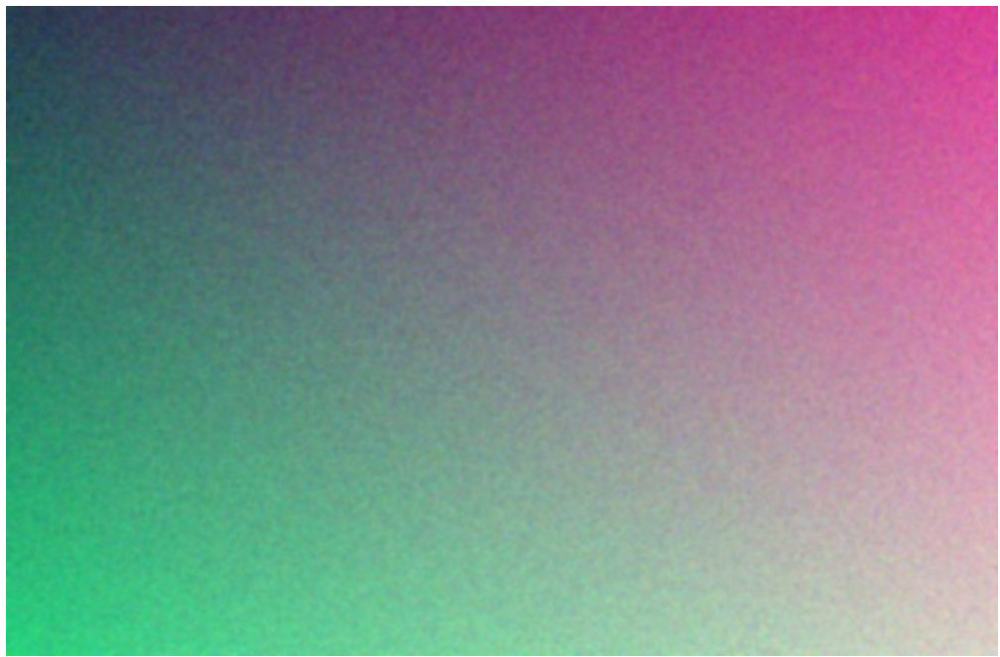

<!-- trang: 1 -->

## Phụ lục: hình ảnh và biểu đồ

*Doanh thu thun (t đng)*

> **[Biểu đồ]** Trend of Sales in Million USD — bar
> 
> The chart shows the sales trend in million USD from 2022 to 2025. The sales have been increasing each year, with the highest sales in 2025 at 1,234.5 million USD. The lowest sales were in 2022 at 905.3 million USD.
> 
> | Year | Sales (in million USD) |
> |---|---|
> | 2022 | 905.3 |
> | 2023 | 1,012.8 |
> | 2024 | 1,099.2 |
> | 2025 | 1,234.5 |
>
> Chữ trong hình: 1.234,5 1.099,2 1.012,8 905,3 2022 2023 2024 2025

*Hình 1. Doanh thu thuần giai đoạn 2022–2025*

> **[Hình ảnh]** The image is a screenshot of a gradient background with a smooth transition from green at the bottom to pink at the top. The gradient appears to be a digital or digitalized effect, possibly used as a backdrop for text or graphics.

*Hình 2. Toàn cảnh nhà máy mới*
